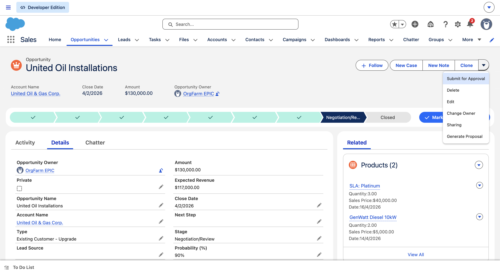
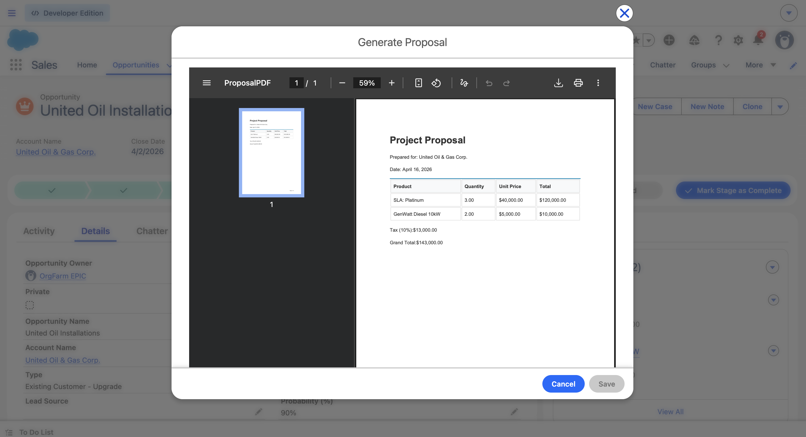

# Visualforce Development: Proposal Manager

This directory contains the logic and UI for the **Proposal Manager** feature. This tool allows users to generate professional PDF documents directly from Opportunity records.

## 📁 Folder Contents
- **classes/**: Contains the `ProposalExtension.cls` Apex controller logic.
- **pages/**: Contains the `ProposalPDF.page` markup.
- **staticresources/**: CSS and images used for styling the PDF.

## 📸 Screen Shots
Here is a visual guide of the Proposal Manager feature in action:

#### Generate Proposal Quick Action
Users can trigger the process directly from any Opportunity record.

#### Generated Proposal PDF (Example)
The end result is a polished, professional PDF.

